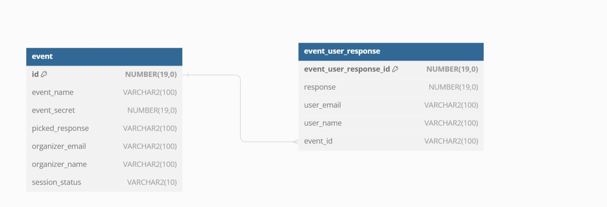
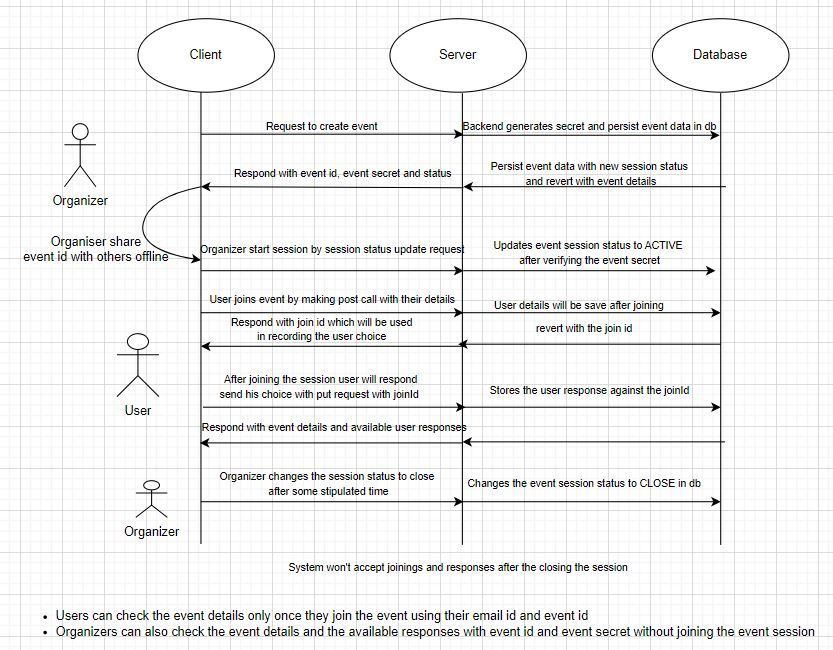

# event-planner
This repo contains event planner application backend codebase.
----------------
Technical Stacks
----------------
- Java 11
- Spring Boot 2
- Oracle 21C database

----------------
Database Schema
----------------
There 2 tables used in this application
- EVENT - Store the event details for which the organizer collecting the user openions
- EVENT_USER_RESPONSE - Responses of all the users are store in this table with respect to the event id.

Please refer the ER Diagram to check the complete schema of the database

--------------
API Contracts
--------------
In total there are 4 REST APIs in this application

- POST <baseurl>/v1/event : This API is to create an event in the database. Organizer of the event will invoke this API

- PUT <baseurl>/v1/event : Organizer will use this API to update the existing event session status - Open session / Close session

- GET <baseurl>/v1/event/{eventId}?email=<>&secret=<>: This API will get all the details of the event including all the responses the event received till that time.
	* Only users who joined the event can access event details and other responses by passing their email
	* Organizer can access the details by passing event secret

- POST <baseurl>/v1/event/join : this will be used by the user to join the event. After joining te event only user can access other responses or record his/her response to the event.
	* The API reverts with joinId if it successfully join the user to the event. This joinId will be used by the user to record their response

- PUT <baseurl>/v1/event/{joinId} : This API will be used by the user to record their response with respect to the join id and event id. User will pass the joinId in the path and evetId,response in the body for this API
Complete API information including request and response object details are provided in the swagger.yaml file.

Postman Collection also added in this repo to make testing effortless.

- All the API's will accept and produce Application/Json request and response types. 

----------------------
Swagger Documentation
----------------------
The application integrated with swagger using springfox library. Everyone can access the swagger ui for this application after using the application. 
		
		To access the swagger UI open <base_url>/swagger-ui/index.html in the browser to check the swagger documentation and test the API using swagger
			example url: http://localhost:8000/swagger-ui/index.html

-------------------
Setup Instructions
-------------------
This application require maven and oracle database as pre-requisites.

- Installation and setup instructions for official maven can be found here https://maven.apache.org/install.html

- Oracle database installation and setup instructions can be found here https://docs.oracle.com/en/database/oracle/oracle-database/21/install-and-upgrade.html
	
	Steps to create user in oracle database
		1. alter session set "_ORACLE_SCRIPT"=true;
		2. CREATE USER <user_name> IDENTIFIED BY <password>;
		3. GRANT ALL PRIVILEGES TO <user_name> 

-----------------------
Evnironmental variables
-----------------------
There are profile based properties files in the application. Currently "dev" profile is active and you can update spring.profiles.active property inside application.properties to activate other profile properties.
	
	ex: create application-prod.properties file with all the required params in resource directory and update spring.profiles.active = prod in application.properties for the production environment deployment. 

After update the properties inside application-dev.properties file with respective values of user created in your database

	spring.datasource.url=<Replace this with your jdbc url. example "jdbc:oracle:thin:@localhost:1521:xe">
	spring.datasource.username=<user_name>
	spring.datasource.password=<password>
	
----------------------
Liquibase Integration
----------------------

The application integrated with liquibase library which will help in schema migration and to create the schema in database when any schema changes.

There is a file called liquibase.properties where env properties related to liquibase will be saved. Liquibase auto pick the properties file. This file has a propetry to locate the changelog file. To change the changelog file path we need to modify the following property in liquibase.properties
			
			spring.liquibase.change-log=classpath:/db/changelog/db.changelog-master.yaml

This db.changelog-master.yaml file contains the schema file location like the following
				
				databaseChangeLog:
					- include:
						file: classpath:/db/changelog/changes/001-initial-schema.sql

001-initial-schema.sql is the initial schema file to create schema in data base startup.

 - With this feature we don't need to create the db schema explicitly while running the application and it also helps to maintain changelog when the schema has been changed.
 
-----------------------
Running the applicatio
-----------------------
There a file named run.sh in the repository home directory. Once setting up all the prerequisites and environmental variables double click the run.sh file to launch the application.

--------
Logging
--------
All the logs in the application including incoming requests and responses will be save into a file. Change the logging properties by updating the below environmental variables inside application.properties

	logging.file.path=/logs/
	logging.file.name=event-planner.log
	logging.level.org.springframework=INFO
	logging.pattern.console=%d{yyyy-MM-dd HH:mm:ss} [%thread] %-5level %logger{36} - %msg%n

---------------------
Solution description (How the application works)
---------------------

 a) By calling create event API (i.e POST <baseurl>/v1/event) the organizer will create event inside the database with the details like event name, organizer name, organizer email
 
   Backend will create an event entry into event table with the organizer details as well as an auto generated event secret and Session status as 'NEW'
 
   The event secret will be usefull to authorize the organizer at the time of changing session status.
   
   Organizer will share event id with all the users offline.
   
 b) An event with 'NEW' status won't accept any responses from the user. The organizer will call an API (i.e PUT <baseurl>/v1/event) to change the session status to 'ACTIVE' with event secret, event id and session status as 'ACTIVE'.
	
  - Now the event with 'ACTIVE' session status will start accepting the responses from the user.
	
  - Reason behind the status change implementation is to give the organizer enough time to share the event id will all the customers offline before starting the session
 
 c) User will call GET <baseurl>/v1/event/{eventId} with the eventId shared by organizer to check the event details after joining and also other user responses till that time.

  - Those who have joined the event only can access the details of an event by passing event id in path and email as the query param
  
  - Also organizer can also access the event details and responses anytime by passign eventsecret and event id to this api
  
 d) The user will call POST <baseurl>/v1/event/join with his name, email to join the session. This API will return a joining id to the user to be used in recording their response.

 e) The user will call PUT <baseurl>/v1/event/join/{joinId} to record their response to the event against join id. User who joined in the event previously only can record their response with joinid.

  - User will pass eventId and user response in the body for this API

 f) Once the organizer feels that it is time to close the session he/she will call the same status change API called in step b with session status as 'CLOSE'
 
   - As soon as the status change to close backend logic will pick a random response from all the responses and store it into the event table as finalized response.
	
   - The event with 'CLOSE' session status won't accept the responses from users.
	
   - Organizer can reopen the event for the responses whenever he/she want to. All the events and responses will be stored in the database.

-------------------------
Enhancement Opportunities
-------------------------
- To make the application generic, I didn't use any specific words like location or session in the application context.
  * With this application can also be used in lottery system where users will join and provide their lottery number as response within the active period and the lottery number will be picked randomly when the session ends.
- In this system we will get the user count who attends the event with the user response count
- We can analyze the user responses to provide ratings and reviews to the places
- The solution can be enhanced to authorized user's by implementing authorization connecting with company user database via Single Sign On (SSO)

----------------------
Alternative Solutions	
----------------------
There are few alternative solutions that come to my mind when I first receive the requirements but I ruled out them due to some reasons.

1) Long Polling solution : Normally to notify the user about the final decision without making him to call an other API we can use this Long Polling solution. But the below points ruled out this solution
		- Long polling is a technique of holding the API response until any update come or request timeout. This will give the application too much burden as the request freequency will be higher in some cases when users are more and session will last for lesser time
		- As we don't have any user interface now it is difficult to demostrate this solution
		- Also to be production ready as per my research some deployment platforms will not allow the request after certain time in idle in such situations user has to call the API again and again till they receive the response
		
2) Caching the responses inside application memory using Redis: This will save time of storing the responses in database. But this also will get the below issues
		- Normally cache will give high performance when there is high volume of read operations. But in our case we need to write the user responses into the cache and also read responses. Thought cache is not a better solution for read-write operations
		- As we store the event details in db and responses in cache in this solution. We need to make 2 transactions to the 2 different sources for every API call. This will be an overhead for the application
		
3) In-Memory DB also a solution in this kind of requirement to boost the performance but In-Memory DB is not reliable in production evnironments as we will be building the application production ready.		
 
